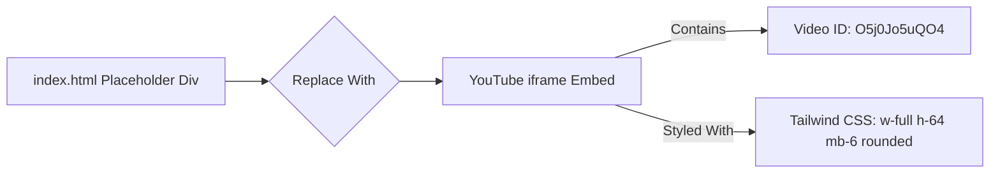

# Plan: Embed Introduction Video

**Task:** Replace the placeholder for an introduction video in `index.html` with a YouTube embed for the video `https://youtu.be/O5j0Jo5uQO4`.

**Location:** The placeholder was identified in `index.html` between lines 127 and 130:
```html
127 |         <!-- Placeholder for intro video -->
128 |         <div class="bg-gray-200 h-40 mb-6 rounded flex items-center justify-center text-gray-500 italic">
129 |             (Intro Video Placeholder)
130 |         </div>
```

**Approved Plan:**

1.  **Extract YouTube Video ID:** The video ID from the URL `https://youtu.be/O5j0Jo5uQO4` is `O5j0Jo5uQO4`.
2.  **Generate Embed Code:** Create a standard YouTube `<iframe>` embed code using the video ID and appropriate Tailwind CSS classes (`w-full h-64 mb-6 rounded`).
3.  **Replace Placeholder:** Replace the placeholder `<div>` (lines 128-130 in `index.html`) with the generated `<iframe>` tag.

**Diagram:**



**Proposed `<iframe>` Code:**

```html
<iframe class="w-full h-64 mb-6 rounded"
        src="https://www.youtube.com/embed/O5j0Jo5uQO4"
        title="YouTube video player - GroupFBMap Introduction"
        frameborder="0"
        allow="accelerometer; autoplay; clipboard-write; encrypted-media; gyroscope; picture-in-picture; web-share"
        referrerpolicy="strict-origin-when-cross-origin"
        allowfullscreen>
</iframe>